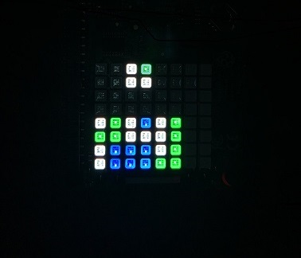

# raspberrypi-2048
2048 game adapted for raspberry pi sense hat
Because there is not enough space on sense hat to place the numbers, they are coded as below

Below is a photo of how it looks like on a real device

## Run the application
Execute main.py to run the application. Use the joystick to control the game. 
